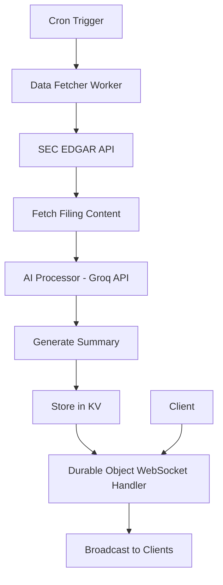

# Architecture Design for WebSocket Server on Cloudflare for AI Summaries of SEC 8-K Filings

## Overview
This design outlines a serverless WebSocket service hosted on Cloudflare that fetches 8-K filings from SEC EDGAR, processes them with AI to generate summaries, and streams these summaries to connected clients in real-time.

## Components

### 1. Data Fetcher
- **Purpose**: Periodically polls the SEC EDGAR API to retrieve new 8-K filings.
- **Technology**: Cloudflare Worker scheduled via Cron Triggers.
- **API**: SEC EDGAR Submissions API (https://www.sec.gov/edgar/searchedgar/submissions.htm).
- **Functionality**:
  - Query for recent filings filtered by form type "8-K".
  - Extract filing URLs and metadata (company, date, etc.).
  - Check against a cache to avoid reprocessing duplicates.

### 2. AI Processor
- **Purpose**: Generates concise summaries of 8-K filing content using AI.
- **Technology**: Integration with Groq API (llama3-8b-8192 or similar).
- **Functionality**:
  - Fetch full filing text (HTML/XML) from SEC.
  - Send text to AI model with prompt for summarization.
  - Receive and format the summary.

### 3. WebSocket Handler
- **Purpose**: Manages client connections and broadcasts summaries.
- **Technology**: Cloudflare Durable Objects for stateful WebSocket connections.
- **Functionality**:
  - Accept WebSocket upgrades from clients.
  - Maintain a list of active connections.
  - Push new summaries to all connected clients.

### 4. Storage/Cache
- **Purpose**: Store processed summaries and track processed filings.
- **Technology**: Cloudflare KV for key-value storage.
- **Functionality**:
  - Cache summaries by filing ID.
  - Store last poll timestamp to fetch only new filings.

## Data Flow
1. **Polling Trigger**: Cron job triggers the Data Fetcher every 5-10 minutes.
2. **Fetch Filings**: Query SEC API for 8-K filings since last poll.
3. **Process Each Filing**:
   - Fetch filing content.
   - Send to AI for summarization.
   - Store summary in KV.
4. **Broadcast**: Send summary to all active WebSocket clients via Durable Object.

## Technologies and APIs
- **Cloudflare Workers**: Serverless execution environment.
- **Durable Objects**: For managing WebSocket state.
- **Cloudflare KV**: For caching.
- **SEC EDGAR API**: For fetching filings.
- **Groq API**: For AI summarization.
- **Language**: TypeScript for Workers.

## Diagram

## Assumptions
- Filings are processed in batches to handle rate limits.
- AI summarization is kept concise (e.g., 100-200 words).
- Clients handle reconnection on disconnect.

## Next Steps
This design focuses on planning. Implementation would involve coding the Workers, setting up APIs, and deploying to Cloudflare.